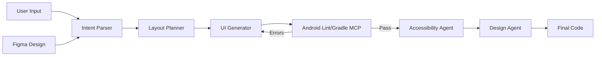

# 📱 Multi-Agent Mobile UI Assistant

[](https://www.python.org/downloads/)
[](https://streamlit.io)
[](https://langchain-ai.github.io/langgraph/)
[](https://opensource.org/licenses/MIT)

A powerful **LangGraph-based multi-agent system** that generates production-ready **Jetpack Compose UI code** from natural language descriptions or Figma designs. It features a modern Streamlit web interface for iterative refinement, real-time preview, and automated code validation.

---

## 🚀 Key Features

*   **🗣️ Natural Language to UI**: Describe your interface in plain English (e.g., "Login screen with email, password, and social login buttons") and get functional Compose code instantly.
*   **🎨 Figma to Code**: Import designs directly from Figma using the **Figma MCP** integration. Extracts layout, colors, and typography automatically.
*   **🤖 Multi-Agent Architecture**:
    *   **Intent Parser**: Understands complex user requirements.
    *   **Layout Planner**: Structures the UI hierarchy (Columns, Rows, Boxes).
    *   **UI Generator**: Writes the actual Kotlin/Compose code.
    *   **Accessibility Reviewer**: Checks for content descriptions, touch targets, and contrast.
    *   **UI Reviewer**: Validates against Material 3 design guidelines.
*   **🛠️ MCP Tools Integration**:
    *   **Android Lint MCP**: Static analysis for common Compose errors (missing imports, modifier misuse).
    *   **Gradle MCP**: Validates Kotlin compilation syntax.
    *   **Figma MCP**: Connects to Figma API for design extraction.
*   **✨ Interactive Refinement**: Use the Streamlit UI to chat with the agent and refine the code (e.g., "Make the button bigger", "Change the color scheme").
*   **🛡️ Auto-Validation & Fix**: Automatically detects and fixes missing imports and syntax errors before showing you the code.
*   **👁️ Visual Preview**: Generates a structural HTML preview of the Compose layout.

---

## 🏗️ Architecture

The system uses a directed cyclic graph (LangGraph) to orchestrate specialized agents:



---

## 🛠️ Installation

### Prerequisites
*   **Python 3.13+**
*   **uv** package manager (Recommended) or `pip`
*   **Git**

### 1. Clone the Repository
```bash
git clone <repository-url>
cd Multi-Agent-Mobile-UI-Assistant-
```

### 2. Install Dependencies
Using `uv` (fastest):
```bash
uv sync
```
Or using `pip`:
```bash
pip install -r requirements.txt
```

### 3. Configure Environment
Create a `.env` file from the example:
```bash
cp .env.example .env
```

Edit `.env` to configure your LLM provider and optional Figma credentials:

**For Ollama (Local, Free):**
```env
LLM_PROVIDER=ollama
LLM_MODEL=llama3.2
OLLAMA_BASE_URL=http://localhost:11434
```

**For OpenAI (Cloud, Best Quality):**
```env
LLM_PROVIDER=openai
LLM_MODEL=gpt-4o
OPENAI_API_KEY=sk-...
```

**For Figma Integration (Optional):**
```env
FIGMA_ACCESS_TOKEN=your_figma_token
```

---

## 💻 Usage

### 🌐 Web Interface (Recommended)
Launch the interactive Streamlit app:
```bash
uv run python app.py
```
Or directly:
```bash
streamlit run src/multi_agent_mobile_ui_assistant/streamlit_interface.py
```
Open **http://localhost:8501** in your browser.

**Web UI Features:**
1.  **Generate**: Type a description or paste a Figma file key.
2.  **Preview**: See a visual representation of the layout.
3.  **Refine**: Chat with the agent to tweak the design.
4.  **Validate**: View linting reports and auto-fix logs.
5.  **Download**: Get the `.kt` file ready for Android Studio.

### ⌨️ CLI Mode
Run the generator from the terminal:
```bash
uv run main.py
```

---

## 🎨 Figma Integration

To use the Figma-to-Code feature:

1.  Get a **Personal Access Token** from Figma (Settings > Account > Personal Access Tokens).
2.  Add it to your `.env` file or enter it in the Streamlit sidebar.
3.  Get the **File Key** from your Figma design URL:
    `https://www.figma.com/file/abc123xyz/My-Design` -> Key is `abc123xyz`.
4.  In the Streamlit app, check "Import from Figma" and enter the key.

---

## 📂 Project Structure

```
.
├── src/multi_agent_mobile_ui_assistant/
│   ├── android_tools_mcp.py    # Linting & Compilation tools
│   ├── figma_mcp.py            # Figma API integration
│   ├── ui_generator.py         # Core LangGraph agent logic
│   ├── streamlit_interface.py  # Web UI
│   └── llm_config.py           # LLM provider setup
├── tests/                      # Unit and integration tests
├── app.py                      # Launcher script
├── pyproject.toml              # Dependencies
└── README.md                   # Documentation
```

---

## 🧪 Testing

Run the comprehensive test suite:

```bash
# Run all tests
uv run pytest

# Run with coverage
uv run pytest --cov=src/multi_agent_mobile_ui_assistant
```

---

## 🤝 Contributing

Contributions are welcome! Please read our [Contributing Guide](CONTRIBUTING.md) (coming soon).

1.  Fork the repo
2.  Create a feature branch (`git checkout -b feature/amazing-feature`)
3.  Commit your changes (`git commit -m 'Add amazing feature'`)
4.  Push to the branch (`git push origin feature/amazing-feature`)
5.  Open a Pull Request

---

## 📄 License

Distributed under the MIT License. See `LICENSE` for more information.
