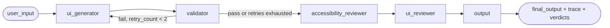

# Architecture Spine — Multi-Agent Mobile UI Assistant Generation Pipeline

## Design Paradigm

**Pipes-and-filters with a feedback edge.** A LangGraph `StateGraph` of pure(ish) node functions, each taking and returning `UIGeneratorState`. One edge is conditional and points backward (`validator → ui_generator`), turning the pipeline into a bounded self-correction loop — this is what makes the multi-agent system's JTBD (self-check and recover) structurally real rather than aspirational.



## Invariants & Rules

### AD-1 — Single-LLM-call generation [ADOPTED]

- **Binds:** FR-1, FR-7
- **Prevents:** Reintroducing separate Intent Parser / Layout Planner preprocessing nodes. The codebase already tried this and found it degrades output quality (see `ui_generator.py:624` comment) — this is existing reality, not a new call.
- **Rule:** `ui_generator` remains one LLM call per attempt. Interpretation of mixed hard-requirement/fuzzy-style input (FR-7) happens inside that single prompt, never as a separate graph stage. The trace panel (AD-4) must not claim stages that don't exist — drop "Intent Parser"/"Layout Planner" from any README/UI copy describing the pipeline.

### AD-2 — Validation is an in-graph node with bounded retry

- **Binds:** FR-1, FR-3, FR-8, NFR (Reliability)
- **Prevents:** Validation-as-afterthought. Today `generate_ui_from_description` calls `AndroidLintMCP`/`GradleMCP` *after* `app.invoke()` returns — outside the graph, un-routable, and invisible to the pipeline's own state. Self-correction cannot be demoed if it isn't structurally part of the graph.
- **Rule:** Add a `validator` node (wraps `AndroidLintMCP.validate_compose_code` + `GradleMCP.check_compilation`) between `ui_generator` and `accessibility_reviewer`. A conditional edge (`add_conditional_edges`) routes back to `ui_generator` when validation fails and `state["retry_count"] < 2`; otherwise it proceeds forward regardless of pass/fail (never blocks demo completion). `retry_count` increments on each loop-back.

### AD-3 — One shared verdict shape across all checks

- **Binds:** FR-2, FR-3
- **Rule:** Every check-producing node (`validator`, `accessibility_reviewer`, `ui_reviewer`) returns a list of `CheckResult`: `{check: str, status: Literal["pass","fail","warn"], message: str}`. `LintIssue`/`CompilationResult` (`android_tools_mcp.py`) map their `severity`/`success` fields into this shape at the validator boundary; reviewer nodes stop emitting mixed prose ("Good: ..." + issue strings in one list) and emit one `CheckResult` per check performed.
- **Prevents:** A verdict UI (FR-3) or trace panel having to string-sniff prose to determine pass/fail — the exact ambiguity that exists today between `accessibility_reviewer_agent`/`ui_reviewer_agent`'s output and `android_tools_mcp`'s clean dataclasses.

### AD-4 — Trace is structured state, not console output

- **Binds:** FR-2
- **Rule:** Every node appends one `TraceStep: {node: str, summary: str, detail: str}` to `state["trace"]: list[TraceStep]`. Streamlit's trace panel renders directly from `result["trace"]`. Existing `print()` calls may stay as a local dev convenience but are never the source a UI reads from.
- **Prevents:** Pipeline reasoning being observable only via server stdout, which is what happens today — unusable for a Streamlit-rendered trace panel (FR-2 as currently specified is unbuildable without this).

### AD-5 — Retry carries memory of why it failed

- **Binds:** AD-2
- **Rule:** State adds `retry_count: int` (default 0) and `last_validation_errors: list[CheckResult]`. On a retry loop-back, `ui_generator` includes `last_validation_errors` in its prompt context so the regenerated code targets the specific failure, not a blind resample.
- **Prevents:** A retry loop that burns attempts repeating the identical mistake because the generator never saw what failed.

## Consistency Conventions

| Concern | Convention |
| --- | --- |
| Node naming | LLM-driven nodes keep the `_agent` suffix (`ui_generator_agent`); deterministic/data nodes use `_node` (`output_node`, new `validator_node`) — matches existing convention, don't invent a new one. |
| Verdict/check shape | Always `CheckResult{check, status, message}` (AD-3) — no ad-hoc issue lists or bare strings for anything user-facing as a pass/fail signal. |
| Trace shape | Always `TraceStep{node, summary, detail}` (AD-4), appended, never replaced — full run history survives to the output. |
| State mutation | Nodes return partial-state dicts merged by LangGraph (existing pattern) — no node mutates `state` in place. |

## Stack

| Name | Version |
| --- | --- |
| langgraph | >=1.0.3 (pinned in pyproject.toml; `add_conditional_edges` already available, no upgrade needed) |
| langchain-core / langchain-openai / langchain-ollama | as pinned in pyproject.toml — unchanged |
| streamlit | >=1.39.0 — unchanged |

## Structural Seed

```text
src/multi_agent_mobile_ui_assistant/
  ui_generator.py       # StateGraph + node functions (ui_generator_agent, validator_node [new],
                         #   accessibility_reviewer_agent, ui_reviewer_agent, output_node)
  android_tools_mcp.py  # LintIssue/CompilationResult -> mapped to CheckResult at validator_node boundary
  streamlit_interface.py# reads result["trace"] and result["*_issues"] (now CheckResult lists) for display
```

## Capability → Architecture Map

| Capability / Area | Lives in | Governed by |
| --- | --- | --- |
| FR-1 core generation loop | `ui_generator_agent` | AD-1 |
| FR-2 agent trace panel | `state["trace"]`, rendered in `streamlit_interface.py` | AD-4 |
| FR-3 self-review verdict | `validator_node`, `accessibility_reviewer_agent`, `ui_reviewer_agent` | AD-2, AD-3 |
| FR-8 auto-fix-on-error surfaced in trace | retry loop-back + `last_validation_errors` | AD-2, AD-4, AD-5 |

## Deferred

- **Real Kotlin compilation.** `GradleMCP.check_compilation` is a brace/paren-counting heuristic, not an actual `kotlinc`/Gradle invocation. Out of scope for this pass — flag as a known limitation in the README rather than silently implying real compilation.
- **Multi-file generation output shape** — existing `multi_file` flag's contract is unchanged by this spine; not touched.
- **Auth, multi-user, persistence beyond session** — explicitly out of scope per PRD.
- **FR-4 (HTML preview) and FR-5 (Figma input)** — already implemented and functioning; this spine doesn't govern them further.
